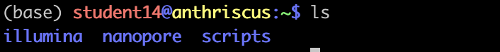
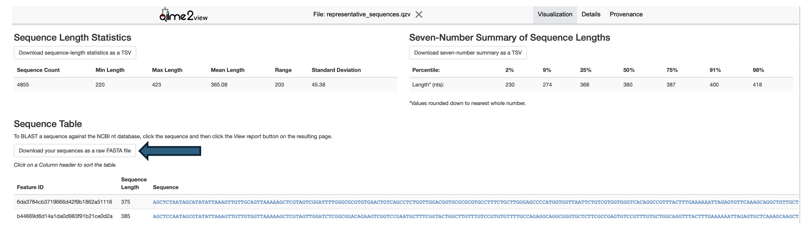
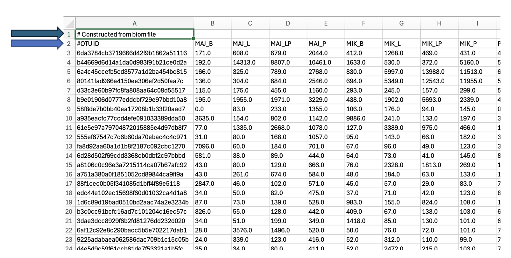

# 4EU+ Protist diversity course 2024

This is a step-by-step instruction for the bioinformatic part of the course. 


<!--- TOC START -->
Table of Contents
-----------------
- [Day-1-From-Reads-to-Taxa](#Day-1)
  - [Introduction](#Introduction)
  - [Illumina](#Illumina)
  - [Nanopore](#Nanopore)
- [Day-2-From-Taxa-to-Diversity](#Day-2)
<!--- TOC END -->


## DAY 1 - From Reads to Taxa


### Introduction

On the first day of the data analysis part of the 4EU-Protist-diversity course, you'll primarily work in the terminal. You will use bioinformatic software installed in [conda](https://anaconda.org/anaconda/conda) package management system. Certain steps will require you to activate conda environment with the command `conda activate environment_name`. To exit the environment, simply type `conda deactivate`.

To analyse Illumina data you will use the [QIIME2](https://qiime2.org) platform with special plugins.


### Illumina


#### 1. Downloading scripts and preparing the working environment

First, download the repository from GitHub to your computer, unzip and then navigate to the unzipped directory. Next, upload the folder 'scripts' to your home folder on the server using the command below (or another solution that works on your system)

```
scp -r scripts studentX@212.87.6.113:~
``` 

In the next step create two folders and enter the folder illumina for the first part of the analysis:

```
mkdir illumina
mkdir nanopore
cd illumina
```

<details>
  <summary>Your home folder should look like this </summary>

  
</details> 


#### 2. Raw reads quality check

First, check read quality using [FastQC](https://www.bioinformatics.babraham.ac.uk/projects/fastqc/). The Illumina sequencing reads from the experiment are available on the server.

```
for file in ../../4UProtistDiversity/raw_illumina/*; do fastqc "$file" -o ./; done
```

Download `.html` files on your computer and open them in the browser.

Please take a look at the command below that you will run using a terminal window on your local machine)

```
scp studentX@212.87.6.113:~/illumina/*.html localdirectory
``` 

***Is the quality good or bad? What else did you notice?***


#### 3. Activating the QIIME 2 environment

Now you will start working in the QIIME 2 environment.

```
conda activate qiime2
```


#### 4. Importing data

The first step is to import your `.fastq` files to a special `.qza` artifacts file.

```
qiime tools import --type "SampleData[PairedEndSequencesWithQuality]" --input-format PairedEndFastqManifestPhred33V2 --input-path ./manifest.tsv --output-path ./demultiplexed-seqs.qza
```

#### 5. Primer trimming

To cut amplification primers you will use the [Cutadapt](https://cutadapt.readthedocs.io/en/stable/) plugin.

```
qiime cutadapt trim-paired --i-demultiplexed-sequences ./demultiplexed-seqs.qza --p-cores 4 --p-front-f CCAGCASCYGCGGTAATTCC --p-front-r ACTTTCGTTCTTGATYRA --o-trimmed-sequences trimmed_demux.qza
```

#### 6. Visualisation of trimmed data quality

In this step, you will create QIIME 2 artifact .qzv which allows data visualisation. 

```
qiime demux summarize --i-data trimmed_demux.qza --o-visualization trimmed_demux.qzv
```

Download `trimmed_demux.qzv` on your computer and upload the file on the [QIIME2View](https://view.qiime2.org) website.
***Investigate both tabs***.


#### 7. Quality filtering, denoising, merging and chimera removal

You will use the [DADA2](https://benjjneb.github.io/dada2/) software to create Amplicon Sequence Variants (ASVs).

This step inculdes lenght trimming. ***How much would you trim forward and reverse reads, to find balance between quality and merging?*** Use `trimmed_demux.qzv` quality plots as a clue.

```
qiime dada2 denoise-paired --p-n-threads 4 --i-demultiplexed-seqs trimmed_demux.qza --p-trunc-len-f ? --p-trunc-len-r ?  --output-dir dada2
```

<details>
  <summary>Suggested command</summary>
  
  ```
  qiime dada2 denoise-paired --p-n-threads 4 --i-demultiplexed-seqs trimmed_demux.qza --p-trunc-len-f 205 --p-trunc-len-r 200  --output-dir dada2
  ```
</details> 


#### 8. Visualisation of DADA2 outputs

Create `.qzv` for all the outputs.

```
qiime metadata tabulate --m-input-file dada2/denoising_stats.qza --o-visualization denoising_stats.qzv
qiime feature-table summarize --i-table dada2/table.qza --o-visualization table.qzv
qiime feature-table tabulate-seqs --i-data dada2/representative_sequences.qza --o-visualization representative_sequences.qzv
```

Again upload files on the [QIIME2View](https://view.qiime2.org) website and ivestigate them.

***What % of your reads merged successfully?***

Additionally, when you will be looking at your obtained representative sequences (representative_sequences.qzv), please download them from the QIIME2View website.

<details>
  <summary>Help here</summary>

  
</details>

 
 And finally upload raw representative sequences (fasta format) to your working directory on the server (folder `illumina`).


#### 9. Exporting files

To assign taxonomy for further diversity analysis, you need to download two files: `ASV table` and `representative sequences` (your ASVs).

OTU table needs to be exported using QIIME2:

```
qiime tools export --input-path dada2/table.qza --output-path exported
biom convert --to-tsv -i exported/feature-table.biom -o exported/feature-table.tsv
```

Created files you will find in the folder 'exported'

Download `feature-table.tsv` to your computer.


#### 10. Taxonomic annotation

You will assign taxonomy using the [VSEARCH](https://github.com/torognes/vsearch) software, which uses global alignment method. For reference you will use the [PR2](https://pr2-database.org) database.

```
vsearch --usearch_global sequences.fasta --db /mnt/databases/pr2_db/pr2_database-5.0.0.fasta --blast6out taxonomy.tsv --id 0.70
```

***Which other databases and methods of assigning taxonomy do you know?***


#### 11. Modifying outputs

Open the downloaded `feature-table.tsv` in Excel, remove the first raw, and change the name in cell A2 from `#OTU` ID to `OTU` and save changes.

<details>
  <summary>Help here</summary>

  
</details>

***What is this file showing us?***


Using Python script you will modify `taxonomy.tsv`

```
../scripts/modify_taxonomy_illumina.py -i taxonomy.tsv -o taxonomy_table.tsv
```

<details>
  <summary>In the case of permission denided error</summary>

  In some cases scripts will run, only after changing their permission rules.

  You can easliy fix it by navigating to the 'scripts' folder and set new permissions.

  ```
chmod 777 *
```
</details>


Download taxonomy_table.tsv to your computer and open in Excel.
***Which taxa are the most present in your samples?***

#### !!! <ins>FINAL OUTCOMES</ins> !!!

Congratulations! You've just finished the first part of today's data analysis!
As a final outputs you obtained:
* `feature-table.tsv` - table of ASVs abundances
* `taxonomy_table.tsv` - table of taxonomy for each ASV


### Nanopore

#### 1. Copying data

For the second part of the day folder `nanopore` will become your working directory.

First, copy your two samples to your working directory.

```
cp ../../4UProtistDiversity/raw_nanopore/sample_name .
```


#### 2. Quality check

For nanopore data we will use two softwares to check the quality, already known FastQC and [NanoPlot](https://github.com/wdecoster/NanoPlot). 
The first command puts your samples to separate folders.

```
for file in *.fastq; do folder_name="${file%.fastq}"; mkdir -p "$folder_name"; mv "$file" "$folder_name"; done
for folder in *; do fastqc "$folder"/*.fastq; done
conda activate nanopore
for folder in *; do NanoPlot --fastq "$folder"/*.fastq --tsv_stats --info_in_report -o "$folder"/nanoplot_raw ; done
```

Again download the `.html` file to your computer and open it in the browser. ***Do you see the difference with illumina dada?***
NanoPlot produces a lot of outputs. One of them is general statistics `NanoStats.txt`. The other ones are plots. Download to your computer two of them `LengthvsQualityScatterPlot_dot.png` and `Non_weightedHistogramReadlength.png` and inspect.
***Which of those two softwares is better for nanopore data and why?*** 


#### 3. Length and quality filtering

Using [Filtlong](https://github.com/rrwick/Filtlong) to filter reads by length and quality.

```
for folder in *; do filtlong --min_length 2000 --max_length 6000  --min_mean_q 90  "$folder"/*.fastq > "$folder"/filtlong.fastq; done
```

#### 4. Comparing quality after filtering

Again perform quality check.

```
for folder in *; do fastqc "$folder"/filtlong.fastq; done
for folder in *; do NanoPlot --fastq "$folder"/filtlong.fastq --tsv_stats --info_in_report -o "$folder"/nanoplot_filtered ; done
```
***Compare the results to non-filtered reads (step 2). What differences do you see?***


#### 5. Extracting 18S rDNA sequences

Using [Barrnap](https://github.com/tseemann/barrnap) extract rDNA fragments from your reads. But first change `filtlong.fastq` to `filtlong.fasta` using `sed` command.

```
for folder in *; do sed -n '1~4s/^@/>/p;2~4p' "$folder"/filtlong.fastq > "$folder"/filtlong.fasta; done
for folder in *; do barrnap --kingdom euk --reject 0.1 --outseq "$folder"/barrnap.fasta "$folder"/filtlong.fasta --threads 4; done
```

***How many different rDNA fragments did you obtain?***

Using Python script you will keep only fragments of 18S rDNA for further analysis.

```
for folder in *; do ../scripts/extracting_18S.py -i "$folder"/barrnap.fasta -o "$folder"/18S_extracted.fasta; done
```

***Do you know why we chose to focus only on 18S rDNA?***


#### 6. Getting average reads quality

For the next step, you need to calculate average read quality for each sample. Python script reclaculates Phred scale quality provided by NanoPlot to quality in percentage values.

```
for folder in *; do echo "$folder"; ../scripts/clustering_treshold_calculations.py -s "$folder"/nanoplot_filtered/NanoStats.txt -e ../scripts/P_error_table.tsv; done
```


#### 7. Clustering

Previously you used VSEARCH to assign taxonomy. However this software has many more functions and clustering is one of them.

```
for folder in *; do mkdir "$folder"/clusters_error; done

# Run the command below separately for your two samples. Remember to setup you folder name and id (eg. -id 0.975)
vsearch --cluster_fast <folder>/18S_extracted.fasta -id <your error> --clusters <folder>/clusters_error/cluster_ --centroids <folder>/centroids_error.fasta 
```


#### 8. Polishing

Polishing is an important step of working with nanopore data, as it's improving reads quality. You will use two softwares [Minimap2](https://github.com/lh3/minimap2) for mapping centroids to sequences before clustering and [Racon](https://github.com/isovic/racon) which performs sequence correction.

```
for folder in *; do minimap2 "$folder"/centroids_error.fasta "$folder"/18S_extracted.fasta > "$folder"/minimap2.paf; done
for folder in *; do racon "$folder"/18S_extracted.fasta -q 20 -w 500 "$folder"/minimap2.paf "$folder"/centroids_error.fasta > "$folder"/racon.fasta; done
```


#### 9. Merging samples

For next step you will need to work on all the samples.
First using Python script add sample names to the headers of your polished sequences.

```
for folder in *; do ../scripts/add_names.py -i "$folder"/racon.fasta -b "$folder" -o "$folder"/"racon_${folder%.*}.fasta"; done
```

Next copy your whole sample folder to the folder `../../4UProtistDiversity/merging_nanopore`.
Finally merge polshed and renamed sequences together.

```
cat ../../4UProtistDiversity/merging_nanopore/*/racon_* > merged_seqs.fasta
```


#### 10. Chimeras removal

Here you will again use VSEARCH, but this time to remove chimeric sequences.

```
vsearch --uchime_ref merged_seqs.fasta --db /mnt/databases/pr2_db/pr2_database-5.0.0.fasta --nonchimeras merged_nonchim_seqs.fasta
```

***What % of sequences turned out to be chimeric? Is it more or less than in case of illumina?***


#### 11. Final clustering

To obtain your final Operational Taxonomic Units (OTUs) you need to cluster together identital sequences from all the samples.

```
mkdir clusters_final
vsearch --cluster_fast merged_nonchim_seqs.fasta  -id 0.99 --clusters clusters_final/cluster_ --centroids otus.fasta
```


#### 12. Taxonomic annotation

You will assign taxonomy and modify the output in the same way you did for illumina. 

```
vsearch --usearch_global otus.fasta --db /mnt/databases/pr2_db/pr2_database-5.0.0.fasta --blast6out taxonomy.tsv --id 0.70
../scripts/modify_taxonomy_nanopore.py -i taxonomy.tsv -o taxonomy_table.tsv
```
Download `taxonomy_table.tsv` to your computer.


#### 13. Abundance calculations

In this step you will use Python scripts to calculate OTUs abundance (based on abundance in clusters) and create final OTU table.

```
for folder in ../../4UProtistDiversity/merging_nanopore/*; do folder_name=$(basename "$folder"); ../scripts/abundance.py -otu otus.fasta -fclu clusters_final -bclu ../4UProtistDiversity/merging_nanopore/"$folder"/clusters_error -b "$folder" -o "abundance_${folder_name}.tsv"; done
../script/create_nanopore_otu_table.py -t taxonomy.tsv -i abun/ -o otu_table.tsv
```

Download `otu_table.tsv` to your computer.


#### !!! <ins>FINAL OUTCOMES</ins> !!!

Congratulations! You've just finished the first day of data analysis!
As a final outputs you obtained:
* `otu_table.tsv` - table of OTUs abundances
* `taxonomy_table.tsv` - table of taxonomy for each OTU


## DAY 2 - From Taxa to Diversity


